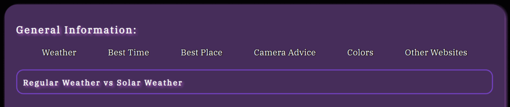
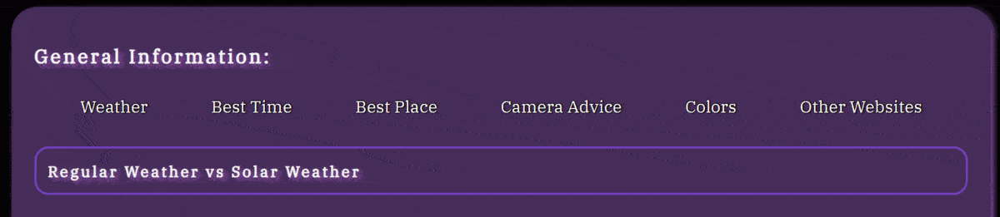

# Aurora Chasers Ireland

## Site Overview
Aurora Chasers Ireland is an information site and resource hub for users who are trying to see the Northern Lights (NL) in Ireland. 

(Am I responsive screenshot)

## Table of contents:
1. [**Site Overview**](#site-overview)
2. [**Project Goals**](#project-goals)
    * [Site Owner Goals](#site-owner-goals)
    * [How This Will Be Achieved](#how-this-will-be-achieved)
3. [**UX**](#ux)
    * [Strategy and Scope](#strategy-and-scope)
        * [Target Audience](#target-audience)
        * [User Stories](#user-stories)
        * [User Requirements](#user-requirements)
    * [Structure and Skeleton](#structure-and-skeleton)
        * [Wireframes](#wireframes)
    * [Features](#features)
        * [Current Features Common to All Pages](#current-features-common-to-all-pages)
        * [Header](#header)
        * [Home Section](#home-section)
        * [Tips and Resources Sections](#tips-and-resources-section)
        * [Gallery Section](#gallery-section)
        * [Contact Us Page](#contact-us-page)
        * [Footer](#footer)
    * [Surface](#surface)
        * [Color Scheme](#color-scheme)
        * [Color Contrast](#color-contrast)
        * [Font](#font)
        * [Technologies Used](#technologies-used)
        * [Language](#language)
        * [Framework and Tools](#framework-and-tools)
        * [Media](#media)
4. [**Testing and Validation**](#testing-and-validation)
    * [HTML](#html)
    * [CSS](#css)
    * [Accessibility and Performance](#accessibility-and-performance)
    * [Browser Compatability](#browser-compatability)
    * [Testing User Stories](#testing-user-stories)
    * [Bugs and Fixes](#bugs-and-fixes)
5. [Deployment and Development](#deployment-and-development)
6. [Credits](#credits)

## Project Goals
### Site Owner Goals
* To provide information on the possibility of seeing the NL in Ireland.
* To provide links to resources which can help the user to see the NL.
* To give advice to the user on how to capture photos of the NL.

### How This Will Be Achieved
* The tips and resources page will be clear and concise.
* Links to external sites which provide live information will be provided and where possible widgets will be embedded to save time.
* There will be a Gallery page for users to enjoy images of the NL taken in Ireland.
* There will be an option to subscribe to a monthly newsletter giving updates on the NL in Ireland.

## UX
### Strategy and Scope

#### Target Audience
* Users who live in Ireland and would like general tips on how to see the NL in Ireland.
* Users who are visiting Ireland and would like more information about where it is possible to see the NL here.
* All age groups.
* Users who wish to be kept updated on the NL in Ireland.

#### User Stories
As a user I would like: 
* to know more about what the NL are and when it is possible to see them and photograph them.
* to get some advice on where I should go to see the NL.
* to know who is behind the page and if it is sponsored etc.
* to be able to navigate the website intuitively and easily.
* information to be concise and helpful as I may not have a lot of time to research.
* I want to see examples of photos taken of the NL from Ireland.
* the option to contact the owner and/or engage with any online communities related to the topic via social media links etc.
* to see live updates about solar and general weather.

#### User Requirements

| Requirements        | Importance           | Viability  |
| ------------- |:-----:| -----:|
|Summary paragraphs of what the NL are, where to see them and how (photography tips).    | 5 | 5 |
| Option to subscribe to a monthly newsletter with updates specific to Ireland.     | 3 | 5 |
| Accommodation and car rental options available | 4 | 3 |
| A gallery of images showcasing the NL as seen from Ireland      | 5 | 5 |
| Information on solar and general weather in Ireland| 5 | 3 |

Trade-off: I determined that creating a section for accommodation and car rental options was less of a priority than the inclusion of solar and general weather information in this iteration of the website based on the table above.

### Structure and Skeleton
Based on the target audience for this site (all ages, all backgrounds), it is important that the site is easy to navigate and will be in the form of a Hierarchical Tree Structure. The site will be intuitive with hover features and the navigation will be learnable with a consistent header and footer across all pages. The user will be assured by feedback when links are clicked.

#### Wireframes
The below wireframes for desktop and mobile devices show the balance between the various elements on each page. 

We do not want to overwhelm them with choices when they visit the site (which could cause them to leave or become frustrated). With this in mind, page numbers will be kept to a minimum (less choice). 

### Features

#### Current Features Common To All Pages

The logo

Nav bar

#### Header
#### Home Section
#### Tips and Resources Section 
#### Gallery Section
#### Contact Us Page
#### Footer

The footer contains links to Social Media pages when you hover on an icon it brightens and a shadow appears below it:

There is a 404 page to redirect the user to the home page in case of an error.
### Surface
#### Color Scheme
#### Color Contrast
#### Font
#### Technologies Used
#### Language
#### Framework and Tools
#### Media

## Testing and Validation
### HTML
### CSS
### Accessibility and Performance
### Browser Compatability
### Testing User Stories
### Bugs and Fixes

Initially, when you hovered on a list item on the Tips & Resources page, it would 'jump' and shift elements around it (pushing down the heading underneath for example):

The menu after adding a transparent 'invisible' border:

## Deployment and Development
The live link

## Credits