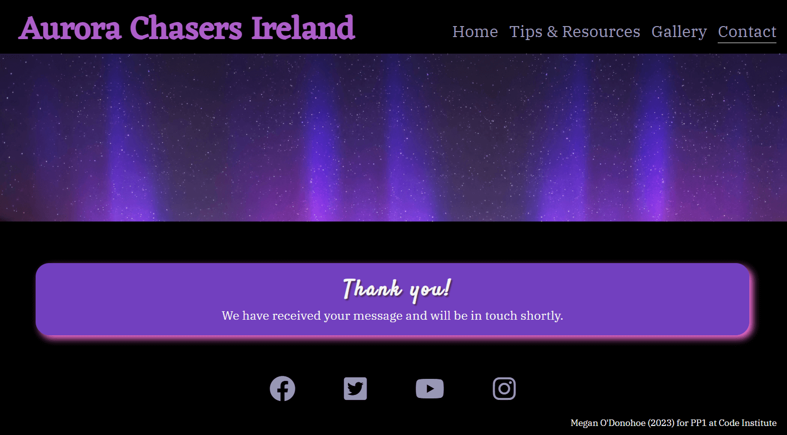

# **Aurora Chasers Ireland**

## **Site Overview**
Aurora Chasers Ireland is an information site and resource hub for users who are trying to see the Northern Lights (NL) in Ireland. 

## **Table of contents:**
---
1. [**Site Overview**](#site-overview)
2. [**Project Goals**](#project-goals)
    * [Site Owner Goals](#site-owner-goals)
    * [How This Will Be Achieved](#how-this-will-be-achieved)
3. [**UX**](#ux)
    * [Strategy and Scope](#strategy-and-scope)
        * [Target Audience](#target-audience)
        * [User Stories](#user-stories)
        * [User Requirements](#user-requirements)
    * [Structure and Skeleton](#structure-and-skeleton)
        * [Wireframes](#wireframes)
    * [Features](#features)
        * [Current Features Common to All Pages](#current-features-common-to-all-pages)
            * [Title](#title)
            * [Hero Image](#hero-image)
            * [Nav Bar](#nav-bar)
            * [Footer](#footer)
        * [Home Section](#home-section)
        * [Tips and Resources Sections](#tips-and-resources-section)
        * [Gallery Section](#gallery-section)
        * [Contact Us Page](#contact-us-page)
        * [404 Page](#404-page)
    * [Surface](#surface)
        * [Color Scheme](#color-scheme)
        * [Color Contrast](#color-contrast)
        * [Font](#font)
        * [Technologies Used](#technologies-used)
4. [**Testing and Validation**](#testing-and-validation)
5. [**Deployment and Development**](#deployment-and-development)
6. [**Future Adaptations**](#future-adaptations)
7. [**Credits**](#credits)
    * [Media](#media)
    * [Content](#content)
    * [Code](#code)
    * [Acknowledgements](#acknowledgements)

## **Project Goals**
---
### **Site Owner Goals**
* To provide information on the possibility of seeing the NL in Ireland.
* To provide links to resources which can help the user to see the NL.
* To give advice to the user on how to capture photos of the NL.

### **How This Will Be Achieved**
* The tips and resources page will be clear and concise.
* Links to external sites which provide live information will be provided and where possible widgets will be embedded to save time.
* There will be a Gallery page for users to enjoy images of the NL taken in Ireland.
* There will be an option to subscribe to a monthly newsletter giving updates on the NL in Ireland.

********************

## **UX**
---
### **Strategy and Scope**

#### **Target Audience**
* Users who live in Ireland and would like general tips on how to see the NL in Ireland.
* Users who are visiting Ireland and would like more information about where it is possible to see the NL here.
* All age groups.
* Users who wish to be kept updated on the NL in Ireland.

#### **User Stories**
As a user I would like: 
* to know more about what the NL are and when it is possible to see them and photograph them.
* to get some advice on where I should go to see the NL.
* to know who is behind the page and if it is sponsored etc.
* to be able to navigate the website intuitively and easily.
* information to be concise and helpful as I may not have a lot of time to research.
* I want to see examples of photos taken of the NL from Ireland.
* the option to contact the owner and/or engage with any online communities related to the topic via social media links etc.
* to see live updates about solar and general weather.

#### **User Requirements**

| Requirements        | Importance           | Viability  |
| ------------- |:-----:| -----:|
|Summary paragraphs of what the NL are, where to see them and how (photography tips).    | 5 | 5 |
| Option to subscribe to a monthly newsletter with updates specific to Ireland.     | 3 | 5 |
| Accommodation and car rental options available | 4 | 3 |
| A gallery of images showcasing the NL as seen from Ireland      | 5 | 5 |
| Information on solar and general weather in Ireland| 5 | 3 |

Trade-off: I determined that creating a section for accommodation and car rental options was less of a priority than the inclusion of solar and general weather information in this iteration of the website based on the table above.

### **Structure and Skeleton**
Based on the target audience for this site (all ages, all backgrounds), it is important that the site is easy to navigate and will be in the form of a Hierarchical Tree Structure. The site will be intuitive with hover features and the navigation will be learnable with a consistent header and footer across all pages. The user will be assured by feedback when links are clicked.

#### **Wireframes**
The below wireframes for desktop and mobile devices show the balance between the various elements on each page. 

Home Page

Tips & Resources Page

Gallery

Contact Us Page

We do not want to overwhelm users with choices when they visit the site (which could cause them to leave or become frustrated). With this in mind, page numbers will be kept to a minimum (less choice). 

### **Features**

#### **Current Features Common To All Pages**

##### **Title**

The title 'Aurora Chasers Ireland' appears on all pages. As you can see in the image below it gives the user feedback when hovered over and returns to 'index.html' when clicked. 

##### **Nav Bar**

The horizontal Nav bar is fully responsive and on mobile devices displays as a vertical list. The active page displays as underlined and there is a shadow effect when the user hovers over any of the list items.

##### **Hero Image**

The hero image shows a photograph of the Northern Lights taken in Donegal (Malin Head) and was sourced from [Shutterstock.com](https://www.shutterstock.com). There is a zoom effect when a page opens for the first time. The zooming out creates a nice effect and is relevant to the theme of the website. It was inspired by the Love Running walkthrough project by Code Institute which I completed prior to this project.

The hero image was originally one file which grew and shrunk depending on the screen size, this caused performance issues with the browser and so a cropped version of the photo (showing the lights) is used for desktop and the full image (including the castle) will only appear on smaller screens.

##### **Footer**

The footer contains links to Social Media pages. When you hover on an icon it brightens and a shadow appears below it.

The bottom right of the footer contains my name and LinkedIn profile if the user wishes to contact the site designer.

### **Home Section**

The home page gives the user an introduction to who Aurora Chasers Ireland. It features two widgets to give quick and easy access to realtime information about Metereological weather and Solar weather for returning users.

### **Tips and Resources Section**

The tips and reources page gives the user consise summarys about what the lights are, where is the best place to see them in Ireland and when. It provides advice for capturing images of the phenomenon and finally it links externally to other websites which may be of interest to the user.

I intended this page to have an expanding menu feature howvever this was not feasible for me in this first iteration of the site (more detail provided in [Testing](#testing-and-validation)) and so I opted for a responsive menu with clickable in-page links. You can see in the image below a border appears when the user hovers over these links. The focus is to get the user access to the information as quickly and intuitively as possible.

### **Gallery Section**

The gallery contains beautiful images of Aurora Borealis taken from Ireland. I would love to include more images in the future (e.g. mobile phone images with permission). The photographer [Rita Wilson](https://www.ritawilsonphotography.com/) kindly gave me permission to use her images in this section. I also sourced images from [Shutterstock.com](https://www.shutterstock.com) and [iStock](https://www.istockphoto.com/). 

This page was created using the flex display and is fully responsive. An overlay describing where the image was taken and its author appear over each photo and a shadow effect appears when an image is hovered over.

### **Contact Us Page**

The contact us page gives the user the option to give feedback to the site owners and/or subscribe to an (as-of-now) fictional newsletter. 

When a user submits their details a confirmation page (one for feedback, one for newsletter) appears to let them know their submission was received and offers to redirect the user back to the homepage.

### **404 Page**

There is a 404 page to redirect the user to the home page in case of an error.

********************

### **Surface**
---
#### **Color Scheme**
The color scheme was extracted in Adobe Color from the header image. I thought these would be exciting and appealing colors for the user. The background for all pages is black to reflect the night sky and to create a nice contrast.

#### **Color Contrast**
A contrast check for the color scheme was done using https://contrast-grid.eightshapes.com/ for accessibility.

The colour was darkened on the contact page due to accessibility issues (more details in TESTING)

#### **Font**

I wanted the font to be rounded and very legible for the website but also have some character. All fonts were sourced from and imported using [Google Fonts](https://fonts.google.com/).

1. ['Eczar'](https://fonts.google.com/specimen/Eczar/) is the title font
2. ['IBM Plex Serif'](https://fonts.google.com/specimen/IBM+Plex+Serif) is used for all other headings and content. I really like the expressive italic and bold options in this style. 
3. ['Satisfy'](https://fonts.google.com/specimen/Satisfy) is used for the homepage signature

'Serif' is the back-up if font 1 and 2 do not load. 'Cursive' is the back-up for font 3.

#### **Technologies Used**

* [Balsamiq](https://balsamiq.com/) to create the wireframes.
* [HTML5](https://en.wikipedia.org/wiki/HTML) for the content and structure of the site.
* [CSS3](https://en.wikipedia.org/wiki/CSS) for all styling on the site.
* [Codeanywhere](https://codeanywhere.com/) IDE for editing the site.
* [Github](https://github.com/) to host the repository and deploy the site.
* [Google Dev Tools](https://developer.chrome.com/docs/devtools/) to troubleshoot and test ideas
* [Tiny PNG](https://tinypng.com/) to compress all images.
* [Am I Responsive?](https://ui.dev/amiresponsive) to generate an image showing responsivness of the site across multiple devices.

********************

## **Testing and Validation**
---

Details of testing during and post development are available in [TESTING.md](TESTING.md)

********************

## **Deployment and Development**
---
The site was deployed to GitHub pages using the following steps:

1. In the GitHub repository, navigate to the Settings tab from the horizontal menu at the top of the page.
2. Click the Settings tab and locate the Pages tab on the left menu which appears.
3. Once you've selected your branch and root directory, click "Save" to deploy your website. GitHub will generate a URL (usually in the format username.github.io/repository-name).
4. A message will be displayed to indicate a successful deployment to GitHub pages and provide the live link.

The live link can be found here - [Aurora Chasers Ireland](https://modonohoe.github.io/aurora-chasers-ireland/).

********************

## **Future Adaptations**
---

•	Once I better understand Javascript, I would like to add a burger menu for mobile-sized device screens. I found articles on achieving this with CSS and HTML alone; however, I did not deem this necessary to create the minimum viable product, which is this project.
•	I would also make the contact form fully function with a post request and have a database to collate data for the mailing list.

https://convertio.co/webp-jpg/

********************

## **Credits**
---
### **Media**

* [Favicon](https://favicon.io/) where the site's favicon was sourced.
* [Adobe Color](https://color.adobe.com/create/image) to generate the color palette.
* [Google Fonts](https://fonts.google.com/) to source and import all fonts.
* [Font Awesome](https://fontawesome.com/) for the icons in the footer and throughout the site.

### **Content**

### **Code**

### **Acknowledgements**
---