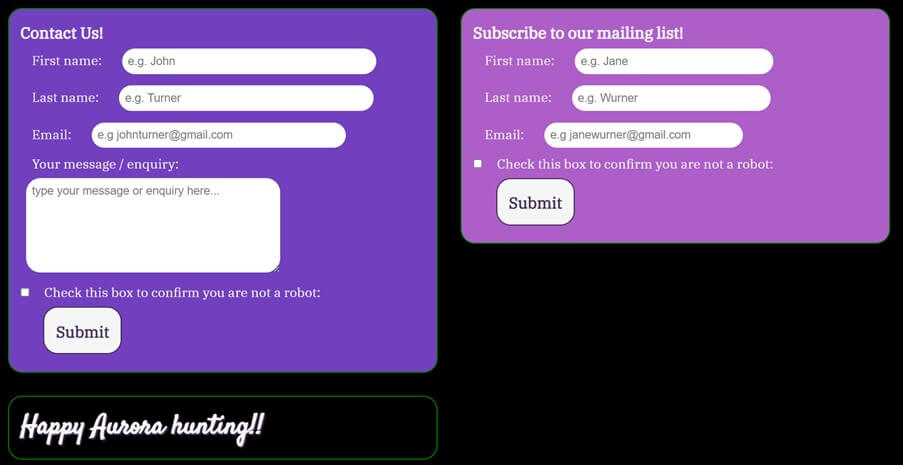

# **Testing and Validation** 
## **Table of contents:**
---
1. [**During Development Testing**](#during-development-testing)
    * [Manual Testing](#manual-testing)
    * [Bugs and Fixes](#bugs-and-fixes)
2. [**Post Development Testing**](#post-development-testing)
    * [**Validators**](#validators)
        * [HTML](#html)
        * [CSS](#css)
        * [Lighthouse](#lighthouse)
    * [**Accessibility**](#accessibility)

## **During Development Testing**
---
### **Manual Testing**
- Throughout the development phase, I manually tested the outcome of my code using the preview option in Codeanywhere using this command in the terminal:
`python3 -m http.server`

- I shared my deployed site with fellow students in the #peer-code-review channel on Code Institute's Slack community.

- My mentor Can Sücüllü provided feedback during our 3 PP1 sessions - inlcuding identifying this UX issue I created when I accidentally removed a margin:

- I viewed my website on the following browsers and it was fully compatible:
1. Chrome
2. Edge
3. Firefox

- The DevTools feature in Chrome allowed me to simulate and accomodate screen sizes from 300px upwards.

- I asked friends and family members to view my site often and provide feedback.

### **Bugs and Fixes:**

Here are a sample of the bugs I came across and how I addressed them while developing my site:

1. **Goal:** Maintain GitHub contributions daily

    

    * **Issue:**
        * During my development phase, I had to change workspace when I ran out of Codeanywhere hours. Luckily my workspace was all saved and up to date and so creating a new workspace was not an issue. However, I noticed after a few days my contributions were not being counted on my GitHub account. I reached out to the Slack community and was reminded to run the following commands when opening each new workspace - not just at the beginning of project.
    * **Solution:** 
        * `git config --global user.name "MEGAN ODONOHOE"`
        * `git config --global user.email "MEGANODT@gmail.com"`

2. **Goal:** Create a nav bar menu that shows pages in order of importance

    

    * **Issue:**
        * Initally my menu was not displaying in order of importance
    * **Solution:** 
        * I researched the Flex property extensively throughout my project and learned this could be addressed by assigning `flex-direction: row-reverse;` in CSS.

3. **Goal:** create a responsive title 

    

    * **Issue:**
        * Initially, on mobile devices the title would overlap and I had difficulty assigning any padding or gap to seperate the overlapped words.
    * **Solution:** 
        * The line-height property `line-height: 1;` and `text-align: center` to display the title better for UX.

4. **Goal:** Display both forms on the contact page side-by-side with a smaller "goodbye message" below the secod smaller form. The forms and message should 'click' together and align vertically on smaller screen sizes.

    

    * **Issue:**
        * I could not get the "goodbye" message to display below the second form as seen above.
    * **Solution:** 
        * Creating a "flexbox within a flexbox" solved the issue and is not something I had considered. When I was using a single flexbox, you could not combine 'X' and 'Y' access displays. There needed to be two seperate flexboxs - one with `flex-direction: row;` and the other `flex-direction: column;` 

5. **Goal:** Display the Twitter widgets responsively on mobile devices

    

    * **Issue:**
        * When viewing the homepage on smaller screens, the twitter widgets would overlap.
    * **Solution:** 
        * I assigned an auto width to the widgets (when importing them initally from twitter I chose 300px which I would not do in future because later I was not able to leave a margin or padding on smaller screens as a result) For screens larger than 300px I assigned `min-width: 350px` to the flexbox containing each widget to solve the ovelapping issue.

6. **Goal:** Use light purple background for mailing list form

    

    * **Issue:**
        * When creating the mailing list, the contrast appeared fine but DevTools highlighted the issue to me.

    

    * **Solution:** 
        * I darkened the purple shade in using Codeanywhere's HEX preview by hovering over the current color and then selecting a darker hue #9a23c6

    

7. **Goal:** Use shadow colors that match the word in the text over a purple background
    * **Issue:**
        * The Experte accessibility validation drew my attention to the following contrast error

    

    * **Solution:** 
        * I compromised on the red colours and opted for 'lightsalmon'and 'lightcoral' instead of true red as this is not accessible in the situation.

    

8. **Goal:** Create an expandable menu feature in my tips and resources section

    

    * **Issue:**
        * I created the menu following a tutorial using only CSS. When I checked the accessibility of this menu, DevTools said it was not compliant for screen readers.
    
    

    * **Solution:** 
        * I decided not to keep it and create a JavaScript version in the future.

9. **Goal:** Style the menu for Tips & Resources to appear 'button-like'

    * **Issue:** 
        * Initially, when you hovered on a list item on the Tips & Resources page, it would 'jump' and shift elements around it (pushing down the heading underneath for example):
    
    
    
    * **Solution:** 
        * The menu after adding a transparent 'invisible' border

    

## **Post Development Testing**
### **Validators**

#### **HTML** 

The W3C Markup Validation Service: [W3C HTML](https://validator.w3.org/)

A number of issues were highlighted during this process.

1. index.html

    

    To resolve the issues above:
    - I removed the 'section' tag and replaced it with a 'div' (this div contains the hero image)
    - For issues 3 and 4 I had mistakenly closed a 'h2' with a 'h3' instead despite scanning over the HTML myself I missed this.
    - Issues 4 and 6 were created by imported HTML in the Twitter widgets. The obsolete values were removed.

2. tips_and_resources.html

    

    To resolve the issues above:
    - I discovered I was not consistently closing my tags correctly. I revised nesting rules and fixed my inconsistencys.

    While editing this page, I had gone back and re-inserted tags which sometimes led to the IDE adding extra closing tags automatically which I didn't notice at the time:

    

3. gallery.html

    

    This first issue relates to the fact that I put my Gallery heading in a seperate section to my Gallery images as I was worried the flex display would become distorted. I replaced the 'section' tag with a 'div' tag for the images in my Gallery.

    

    While designing my Gallery, I encountered many issues. At one point during the development I had inserted paragraphs into the Gallery. In the deployed version of my website, all of my Gallery containers are 'divs', however, at one point they were paragraphs which was incorrect and highlighted by the validator.

The HTML on all other pages showed no issues. 

Once I had addressed all of the issues highlighted as above, I ran all of my pages through the validator again and there were no issues detected.

#### **CSS** 

The W3C CSS Validation Service: [W3C CSS](https://jigsaw.w3.org/css-validator/)

* No issues were found.

### **Lighthouse Scores**

I used the Lighthouse Validator in Chrome DevTools site-wide. As mentioned already, Lighthouse helped me to identify that my expandable menu was not accessible.

Here are the scores I received for the desktop version of each page and:

1. index.html

    

2. tips_and_resources.html

    

3. gallery.html

    

    The performance score is not what I would like it to be on this page and I did some research into the issues highlighted. For future projects I will use 'next-gen' formats for my images. 

    

4. contact.html

    

My performance scores on mobile greatly vary depending on device and screen-size. Again this mostly relates to my image format. This is something I discovered very late into my development so I am happy to leave this as unresolved for now rather than redo my image files and pathways in case this results in error.
  
### **Accessibility**

I am satisfied with my accessibility scores from Lighthouse. I have also mentioned the issues highlighted to me by [Experte.com](https://www.experte.com/accessibility) accessibility validator above (contrast issue). Once this was resolved, it could not identify any other issues.

My Web Accessibility Evaluation Tool ['WAVE' result](https://wave.webaim.org/report#/https://modonohoe.github.io/aurora-chasers-ireland) shows no errors (except for flagging underlined text it was unsure were links, which are links so this is fine). It also highlighted a color contrast issue but this is unseen and is identified as being part of the Twitter widgets. 

All other pages have no flags or errors reported.

Lastly, I discovered in my research that links should never contain the text 'Click Here'. Having seen many such links in my time on the internet, I was unaware that this was bad practice but [This UX article](https://uxmovement.com/content/why-your-links-should-never-say-click-here/) explained why this should be avoided and I removed all 'Click Here' links on my page.